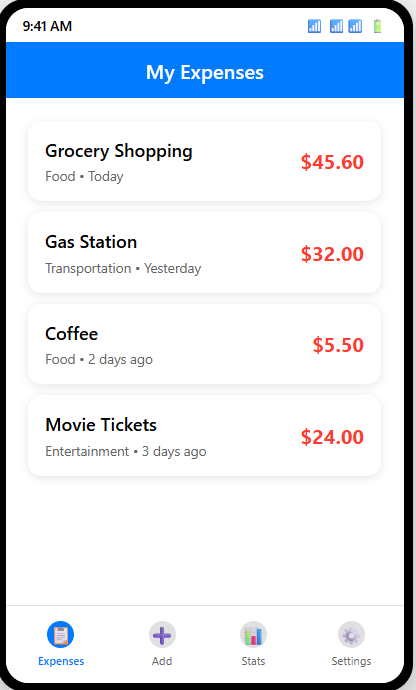
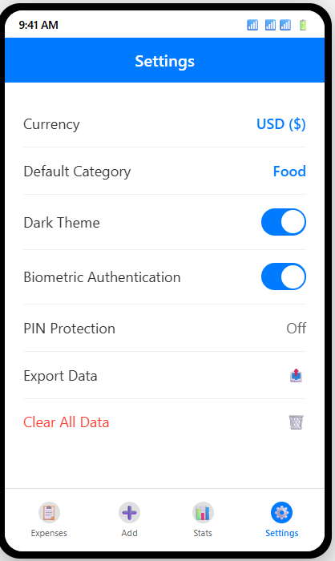
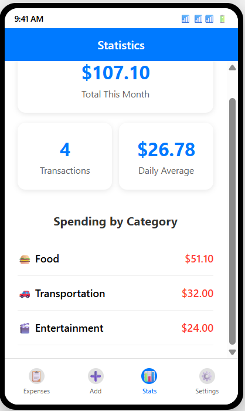

# 💰 Expense Tracker App

A comprehensive React Native expense tracking application designed to help users manage their finances with ease, security, and powerful analytics.

## 📱 Overview

The Expense Tracker App is a full-featured mobile application built with React Native that enables users to track, categorize, and analyze their expenses. With a clean, intuitive interface and robust data management capabilities, users can gain valuable insights into their spending habits while keeping their financial data secure.

## 📸 App Screenshots

Get a glimpse of the app's sleek interface and powerful features:

### 🏠 Home Screen - Expense List
  
*View all your expenses in a clean, organized list with category icons and quick access to details*

### ➕ Add Expense Screen
  
*Intuitive form interface for adding new expenses with validation and category selection*

### 📋 Expense Details
  
*Detailed view of individual expenses with edit and delete options*

### ⚙️ Settings Screen
  
*Comprehensive settings panel with security options, themes, and data management*

### 📊 Statistics Dashboard
  
*Powerful analytics showing spending patterns, category breakdowns, and monthly insights*


## ✨ Features

### 🏠 Core Functionality
- **Expense Management**: Add, edit, delete, and view detailed expense records
- **Smart Categorization**: Organize expenses across 8 predefined categories
- **Real-time Updates**: Instant synchronization with pull-to-refresh functionality
- **Search & Filter**: Quick expense lookup and filtering capabilities

### 📊 Analytics & Insights
- **Monthly Summaries**: Track total spending and transaction counts
- **Category Breakdown**: Visual representation of spending by category
- **Daily Averages**: Calculate average daily expenditure
- **Spending Trends**: Monitor financial patterns over time


## 🛠️ Technology Stack

### Frontend Framework
- **React Native**: Cross-platform mobile development
- **React Navigation**: Tab and stack navigation system
- **FlatList**: Optimized list rendering for expense data

### Data Storage
- **SQLite**: Local database for expense records
- **AsyncStorage**: User preferences and settings
- **SecureStore**: Encrypted storage for sensitive data

### UI Components
- **TextInput**: Form input handling
- **Date Picker**: Intuitive date selection
- **Category Picker**: Dropdown selection for expense categories
- **Custom Icons**: Category-specific visual indicators

## 📋 Prerequisites

Before running this application, ensure you have the following installed:

- Node.js (v14 or higher)
- React Native CLI or Expo CLI
- Android Studio (for Android development)
- Xcode (for iOS development, macOS only)

## 🚀 Installation

1. **Clone the repository**
   ```bash
   git clone https://github.com/yourusername/expense-tracker-app.git
   cd expense-tracker-app
   ```

2. **Install dependencies**
   ```bash
   npm install
   # or
   yarn install
   ```

3. **Install required packages**
   ```bash
   npm install @react-navigation/native @react-navigation/bottom-tabs @react-navigation/stack
   npm install react-native-screens react-native-safe-area-context
   npm install expo-sqlite expo-secure-store
   ```

4. **Platform-specific setup**
   
   **For iOS:**
   ```bash
   cd ios && pod install && cd ..
   ```
   
   **For Android:**
   Ensure Android SDK is properly configured

5. **Run the application**
   ```bash
   # For iOS
   npx react-native run-ios
   
   # For Android
   npx react-native run-android
   ```

## 📱 App Structure

```
src/
├── screens/
│   ├── HomeScreen.js          # Main expense list
│   ├── AddExpenseScreen.js    # Add new expense form
│   ├── StatisticsScreen.js    # Analytics and insights
│   ├── SettingsScreen.js      # App configuration
│   ├── ExpenseDetailsScreen.js # Individual expense view
│   └── EditExpenseScreen.js   # Edit existing expenses
├── navigation/
│   ├── TabNavigator.js        # Bottom tab navigation
│   └── StackNavigator.js      # Stack navigation setup
├── database/
│   ├── DatabaseService.js     # SQLite operations
│   └── schema.sql            # Database schema
├── components/
│   ├── ExpenseItem.js        # Individual expense list item
│   ├── CategoryIcon.js       # Category visual indicators
│   └── LoadingSpinner.js     # Loading state component
├── utils/
│   ├── storage.js            # AsyncStorage utilities
│   ├── secureStorage.js      # SecureStore utilities
│   └── validation.js        # Form validation helpers
└── styles/
    ├── global.js             # Global styling
    └── themes.js             # Light/dark theme definitions
```

## 🗄️ Database Schema

The app uses SQLite with the following expense table structure:

```sql
CREATE TABLE expenses (
    id INTEGER PRIMARY KEY AUTOINCREMENT,
    title TEXT NOT NULL,
    amount REAL NOT NULL,
    category TEXT NOT NULL,
    date TEXT NOT NULL,
    description TEXT,
    created_at DATETIME DEFAULT CURRENT_TIMESTAMP
);
```

## 📊 Categories

The app supports 8 predefined expense categories:

- 🍔 **Food**: Meals, groceries, dining out
- 🚗 **Transportation**: Gas, public transit, rideshare
- 🎬 **Entertainment**: Movies, games, subscriptions
- 🛍️ **Shopping**: Clothing, electronics, personal items
- 💡 **Bills**: Utilities, rent, insurance
- 🏥 **Healthcare**: Medical expenses, pharmacy
- 📚 **Education**: Books, courses, training
- 📦 **Other**: Miscellaneous expenses


## 📈 Analytics Dashboard

The Statistics screen provides comprehensive spending insights:

- **Monthly Overview**: Total expenses and transaction count
- **Daily Average**: Calculate spending patterns
- **Category Breakdown**: Visual spending distribution
- **Trend Analysis**: Monitor spending over time
- **Date Range Filtering**: Custom period analysis

## 🧪 Testing

Run the test suite to ensure app functionality:

```bash
# Run all tests
npm test

# Run tests with coverage
npm test -- --coverage

# Run specific test file
npm test ExpenseService.test.js
```

## 🎨 UI/UX Features

- **Responsive Design**: Optimized for various screen sizes
- **Smooth Animations**: Engaging user interactions
- **Pull-to-Refresh**: Easy data synchronization
- **Swipe Gestures**: Intuitive expense management
- **Loading States**: Clear feedback during operations
- **Error Handling**: Graceful error management with user-friendly messages

## 🐛 Troubleshooting

### Common Issues

**Database not initializing:**
- Ensure SQLite package is properly installed
- Check database permissions

**Navigation not working:**
- Verify React Navigation dependencies
- Check navigation structure setup

**Authentication failing:**
- Confirm device biometric settings
- Verify SecureStore permissions

## 🤝 Contributing

We welcome contributions to improve the Expense Tracker App! Please follow these steps:

1. Fork the repository
2. Create a feature branch (`git checkout -b feature/amazing-feature`)
3. Commit your changes (`git commit -m 'Add amazing feature'`)
4. Push to the branch (`git push origin feature/amazing-feature`)
5. Open a Pull Request

### Development Guidelines
- Follow React Native best practices
- Maintain consistent code formatting
- Add tests for new features
- Update documentation as needed

## 📄 License

This project is licensed under the MIT License - see the [LICENSE](LICENSE) file for details.

## 🔄 Version History

### v1.0.0 (Current)
- ✅ Complete CRUD operations for expenses
- ✅ SQLite database integration
- ✅ Tab and stack navigation
- ✅ Security features with biometric auth
- ✅ Statistics and analytics dashboard
- ✅ Theme support and customization
- ✅ Data export and management

### Upcoming Features
- 🔄 Cloud backup integration
- 🔄 Budget setting and tracking
- 🔄 Receipt photo attachments
- 🔄 Recurring expense management
- 🔄 Advanced reporting features

---

**Built with ❤️ for better financial management**
